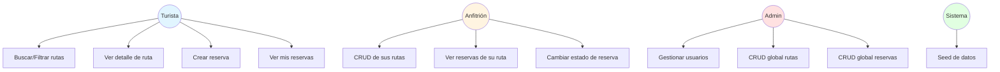
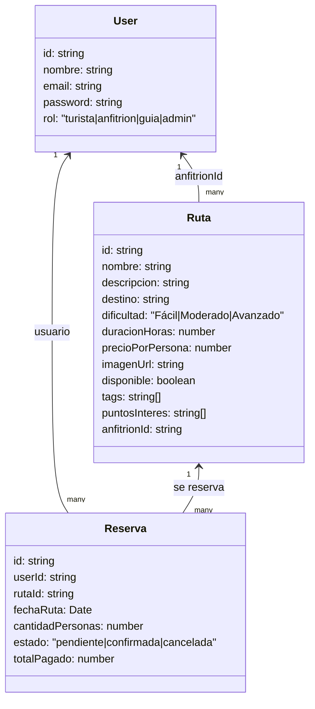

# Eje Cafetero - Plataforma de Rutas Turísticas

Plataforma web para descubrir y reservar rutas turísticas en el Eje Cafetero colombiano.

## Stack Tecnológico

- **Backend**: Node.js + Express + TypeScript
- **ORM**: Drizzle ORM
- **Base de datos**: PostgreSQL
- **Frontend**: React + Vite + TypeScript
- **Estilos**: Tailwind CSS + shadcn/ui
- **Autenticación**: JWT + Passport.js

## Características

- Sistema de autenticación con roles (turista, anfitrión, guía, admin)
- Búsqueda y filtrado de rutas por destino, dificultad, precio y tags
- Sistema de reservas con gestión de estados
- Panel de gestión para anfitriones
- Panel de administración

## Casos de Uso



## Modelo de Datos



## Instalación y Configuración

### Requisitos

- Node.js 20+
- PostgreSQL

### Pasos de Instalación

1. Instalar dependencias:
```bash
npm install
```

2. Configurar variables de entorno (ya configuradas en Replit)

3. Crear las tablas en la base de datos:
```bash
npm run db:push
```

4. Poblar la base de datos con datos de ejemplo:
```bash
npm run seed
```

5. Iniciar la aplicación:
```bash
npm run dev
```

La aplicación estará disponible en `http://localhost:5000`

## Scripts Disponibles

- `npm run dev` - Inicia el servidor de desarrollo
- `npm run build` - Compila el proyecto para producción
- `npm run start` - Inicia el servidor en producción
- `npm run check` - Verifica tipos de TypeScript
- `npm run db:push` - Sincroniza el esquema con la base de datos
- `npm run seed` - Puebla la base de datos con datos de ejemplo

## API Endpoints

### Autenticación
- `POST /api/auth/register` - Registrar nuevo usuario
- `POST /api/auth/login` - Iniciar sesión
- `GET /api/auth/me` - Obtener usuario actual (requiere auth)

### Rutas
- `GET /api/rutas` - Listar rutas (con filtros opcionales: destino, dificultad, precioMax, q, tag)
- `GET /api/rutas/:id` - Obtener detalle de una ruta
- `POST /api/rutas` - Crear ruta (admin)
- `PATCH /api/rutas/:id` - Actualizar ruta (admin)
- `DELETE /api/rutas/:id` - Eliminar ruta (admin)

### Reservas
- `GET /api/reservas/mias` - Listar mis reservas (requiere auth)
- `GET /api/reservas` - Listar todas las reservas (admin)
- `GET /api/reservas/por-ruta/:rutaId` - Listar reservas de una ruta (anfitrión/admin)
- `POST /api/reservas` - Crear reserva (requiere auth)
- `PUT /api/reservas/:id/estado` - Cambiar estado de reserva (anfitrión/admin)

## Roles y Permisos

- **Turista**: Puede buscar rutas, ver detalles y crear reservas
- **Anfitrión**: Puede gestionar sus rutas y las reservas asociadas
- **Guía**: Role reservado para futuras funcionalidades
- **Admin**: Acceso completo al sistema

## Estructura del Proyecto

```
├── client/               # Frontend React
│   ├── src/
│   │   ├── components/  # Componentes reutilizables
│   │   ├── pages/       # Páginas de la aplicación
│   │   └── lib/         # Utilidades y configuración
├── server/              # Backend Express
│   ├── auth.ts         # Autenticación y autorización
│   ├── db.ts           # Configuración de la base de datos
│   ├── routes.ts       # Rutas de la API
│   ├── storage.ts      # Capa de acceso a datos
│   └── seed.ts         # Script de datos de ejemplo
├── shared/             # Código compartido
│   └── schema.ts       # Esquemas de base de datos y validación
└── package.json
```

## Datos de Ejemplo

Después de ejecutar `npm run seed`, tendrás:

**Usuarios**:
- Admin: `admin@ejcafetero.com` / `123456`
- Anfitrión: `carlos@ejcafetero.com` / `123456`
- Turista 1: `maria@email.com` / `123456`
- Turista 2: `juan@email.com` / `123456`

**Rutas**: 6 rutas en diferentes destinos del Eje Cafetero (Salento, Filandia, Manizales, Pereira, Montenegro, Sevilla)

**Reservas**: 2 reservas de ejemplo

## Desarrollo

Este proyecto utiliza TypeScript en todo el stack. El código es compilado automáticamente en modo desarrollo gracias a `tsx`.

Para verificar errores de tipos:
```bash
npm run check
```

## Licencia

MIT
